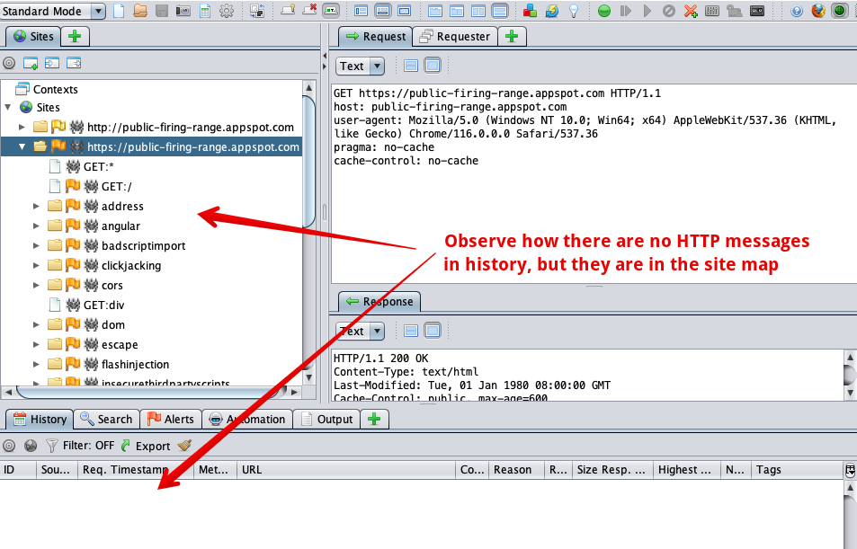

# ZAP Session Issue

Example code for an issue with ZAP where we are not able to see messages in the history tab after loading a session.

## Steps to reproduce

Run the following:

```bash
./spider.sh
```

This will run a spider using ZAP against Google Public Firing Range, save the session, kill Docker, and then load the session into ZAP Desktop.

After it loads into ZAP Desktop, observe that the history tab is empty.


